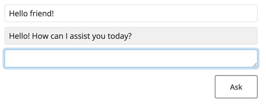

[](https://codespaces.new/colearendt/shiny-chat?quickstart=1)

# Shiny Chat

Using [chatstream](https://github.com/wch/chatstream/tree/main) to show how easy an OpenAI chat app is!!

## Getting Setup

### Load a `virtualenv`

Make sure you have a `virtualenv` loaded!

For example:

```
/opt/python/3.12.3/bin/python -m venv ./venv
source ./venv/bin/activate
```

### Install packages

Install packages (just `chatstream` and its dependencies, like `shiny`)

```
pip install -r requirements.txt
```

## OpenAI Url
Then determine the `OPENAI_URL` for your OpenAI target.

### Personal Use
```
echo "OPENAI_URL=https://api.openai.com/v1/" > .env
```

Make sure to set an `OPENAI_API_KEY` in your environment too.

### Workshops
```
echo "OPENAI_URL=http://openai.ai.svc.cluster.local" > .env
```

Authentication is handled for you!

## Run the App

Then run the app!

```
shiny run app.py
```

## Done!

You should see a Shiny Chat app running, and see the results that look like this:


